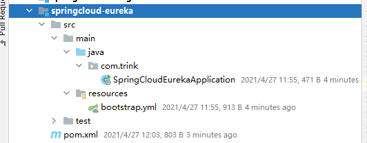

#SpringCloudDemo

## 1.初始化环境
父工程maven的xml：
~~~xml
<?xml version="1.0" encoding="UTF-8"?>
<project xmlns="http://maven.apache.org/POM/4.0.0"
xmlns:xsi="http://www.w3.org/2001/XMLSchema-instance"
xsi:schemaLocation="http://maven.apache.org/POM/4.0.0 http://maven.apache.org/xsd/maven-4.0.0.xsd">
<modelVersion>4.0.0</modelVersion>

    <groupId>com.trink</groupId>
    <artifactId>my-cloud-demo</artifactId>
    <packaging>pom</packaging>
    <version>1.0-SNAPSHOT</version>

    <properties>
        <project.build.sourceEncoding>UTF-8</project.build.sourceEncoding>
        <java.version>1.8</java.version>
        <project.version>1.0-SNAPSHOT</project.version>

        <spring-boot.version>2.1.3.RELEASE</spring-boot.version>
        <spring-cloud.version>Greenwich.RELEASE</spring-cloud.version>
        <spring-platform.version>Cairo-SR7</spring-platform.version>

        <druid.version>1.1.10</druid.version>
        <mysql.version>5.1.45</mysql.version>
        <hutool.version>4.4.5</hutool.version>
        <mybatis-plus.version>3.1.0</mybatis-plus.version>
    </properties>

    <!-- 引入spring boot starter的依赖 -->
    <parent>
        <groupId>org.springframework.boot</groupId>
        <artifactId>spring-boot-starter-parent</artifactId>
        <version>2.1.3.RELEASE</version>
    </parent>

    <dependencyManagement>
        <dependencies>
            <!--统一管理spring boot相关依赖版本-->
            <dependency>
                <groupId>org.springframework.boot</groupId>
                <artifactId>spring-boot-dependencies</artifactId>
                <version>${spring-boot.version}</version>
                <type>pom</type>
                <scope>import</scope>
            </dependency>
            <!--统一管理spring cloud相关依赖版本-->
            <dependency>
                <groupId>org.springframework.cloud</groupId>
                <artifactId>spring-cloud-dependencies</artifactId>
                <version>${spring-cloud.version}</version>
                <type>pom</type>
                <scope>import</scope>
            </dependency>
            <!--spring版本管理工具-->
            <!--使用这一依赖可以实现spring相关第三方依赖自动适配版本号而不需要填写version-->
            <dependency>
                <groupId>io.spring.platform</groupId>
                <artifactId>platform-bom</artifactId>
                <version>${spring-platform.version}</version>
                <type>pom</type>
                <scope>import</scope>
            </dependency>
            <!--mybatis plus-->
            <dependency>
                <groupId>com.baomidou</groupId>
                <artifactId>mybatis-plus-boot-starter</artifactId>
                <version>${mybatis-plus.version}</version>
            </dependency>
            <!--mybatis plus extension,包含了mybatis plus core-->
            <dependency>
                <groupId>com.baomidou</groupId>
                <artifactId>mybatis-plus-extension</artifactId>
                <version>${mybatis-plus.version}</version>
            </dependency>
        </dependencies>
    </dependencyManagement>

    <build>
        <plugins>
            <plugin>
                <groupId>org.springframework.boot</groupId>
                <artifactId>spring-boot-maven-plugin</artifactId>
            </plugin>
        </plugins>
    </build>
    <!--强制使用阿里maven镜像-->
    <repositories>
        <repository>
            <id>aliyun</id>
            <name>aliyun</name>
            <url>https://maven.aliyun.com/repository/public</url>
            <releases>
                <enabled>true</enabled>
            </releases>
            <snapshots>
                <enabled>false</enabled>
            </snapshots>
        </repository>
    </repositories>

</project>
~~~
##2.注册中心
创建工程：springcloud-eureka

注册中心maven的xml：
~~~xml
<?xml version="1.0" encoding="UTF-8"?>
<project xmlns="http://maven.apache.org/POM/4.0.0"
         xmlns:xsi="http://www.w3.org/2001/XMLSchema-instance"
         xsi:schemaLocation="http://maven.apache.org/POM/4.0.0 http://maven.apache.org/xsd/maven-4.0.0.xsd">
    <parent>
        <artifactId>my-cloud-demo</artifactId>
        <groupId>com.trink</groupId>
        <version>1.0-SNAPSHOT</version>
    </parent>
    <modelVersion>4.0.0</modelVersion>

    <artifactId>springcloud-eureka</artifactId>
    <description>注册中心</description>

    <dependencies>
        <dependency>
            <groupId>org.springframework.cloud</groupId>
            <artifactId>spring-cloud-starter-netflix-eureka-server</artifactId>
        </dependency>
    </dependencies>

</project>
~~~
启动类：
~~~java
package com.trink;

import org.springframework.boot.SpringApplication;
import org.springframework.boot.autoconfigure.SpringBootApplication;
import org.springframework.cloud.netflix.eureka.server.EnableEurekaServer;

/**
 * @author Trink丶
 */
@EnableEurekaServer
@SpringBootApplication
public class SpringCloudEurekaApplication {
    public static void main(String[] args) {
        SpringApplication.run(SpringCloudEurekaApplication.class, args);
    }
}
~~~
配置文件：bootstrap.yml
~~~yaml
server:
  port: 8761 #暴露服务端口
spring:
  application:
    name: springcloud-eureka #服务id
eureka:
  client:
    # 是否要注册到其他Eureka Server实例
    register-with-eureka: false
    # 是否要从其他Eureka Server实例获取数据
    fetch-registry: false
    service-url:
      defaultZone: http://localhost:8761/eureka/ #供Eureka客户端使用的注册路径
  server:
    eviction-interval-timer-in-ms: 4000 # eureka server清理无效节点的时间间隔，默认60000毫秒，即60秒
    enable-self-preservation: false # 自我保护模式，当出现出现网络分区、eureka在短时间内丢失过多客户端时，会进入自我保护模式，即一个服务长时间没有发送心跳，eureka也不会将其删除，默认为true
    renewal-percent-threshold: 0.9 # Eureka Server 自我保护系数，当enable-self-preservation=true时，起作用
~~~
完成后的样子：

